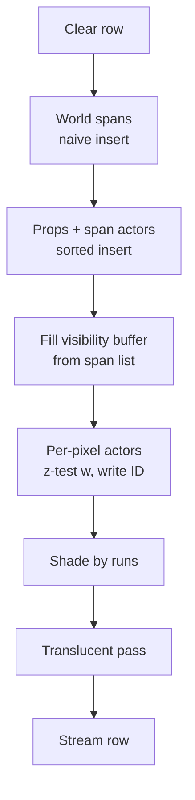

# Software Rasterizer: Span Buffer Module Spec

Sep 23, 2026 · @Chocolate Sprocket

## Overview and scope

This module turns projected polygons into per-row span data, then renders each screen row in a private scratchpad and streams it to the framebuffer. It targets 1280×720 at 60 FPS on a multicore CPU, written in Rust, with no GPU and no inline assembly (SIMD intrinsics are allowed).

**Performance targets**

| Metric | Target |
| --- | --- |
| Resolution | 1280×720, 32-bit XRGB |
| Frame rate | 60 FPS (16.67 ms per frame) |
| Pixel throughput | 55.3 M pixels/s |
| Framebuffer write bandwidth | \~221 MB/s |
| Per-pixel budget (8 cores, 3 GHz) | \~430 cycles |

Pixel fill is not expected to be the bottleneck. The main risks are span generation cost and texture memory access.

**In scope**

- Convex polygons of any vertex count as the core primitive (a triangle is the 3-vertex case)
- Polygon setup and per-band binning in phase 1; live edge walking in phase 2
- Two opaque raster paths, selectable per mesh: sorted span insertion with an exact two-point overlap resolve, and a per-pixel visibility buffer
- World geometry and simple props (crates, doors, elevators) always use span insertion; actor meshes default to the visibility buffer and can be switched to span insertion with one setting
- Shade-once per visible opaque pixel through run-grouped shading
- Translucent polygons, drawn after all opaque geometry
- Vertex attribute system (required, polygon-wide, and arbitrary varyings)
- Perspective-correct interpolation with adaptive subdivision
- Shader definition, validation, and dispatch
- Small-texture bilinear sampling

**Out of scope for this module**

- Reflections, depth-based fades, and Fresnel effects. These are shader-level concerns; the only requirement here is that translucent surfaces have their own span buffer.
- Vertex transform, frustum and near-plane clipping, and visibility (portals, culling). Covered in the next planning pass.
- Framebuffer presentation and windowing.

## Frame pipeline and threading model

Each frame runs in two strictly separate phases with a barrier between them. No row is rendered until every polygon has been converted to span data, because a partially built row would produce wrong results.


Draw calls, polygon setup, and binning all happen before the barrier. Edge walking, visibility resolution, and shading happen only in phase 2. No spans are stored between the phases.

**Ownership rules**

- Phase 1: work is split by polygon. Each thread writes only to its own polygon arena and its own per-band bins (see Phase 1). No atomics, no locks, no shared writes.
- Phase 2: work is split by row bands. Each thread owns a band exclusively, reads every thread's bins for that band through shared references, and writes only its own rows.
- The rule "no two threads ever write the same memory in the same phase" is an architectural invariant. It should be enforced by the Rust borrow checker: `&mut` access to own arena and bins in phase 1, `&mut` access to own framebuffer rows in phase 2 (for example via `par_chunks_mut`), `&` access to all bins and arenas in phase 2.

**Row scheduling in phase 2**

- Rows are grouped into bands of 8–16 rows (tunable). Threads claim bands dynamically from a shared atomic counter.
- Contiguous bands are preferred over stride interleaving: edge walking and texture access stay coherent, and triangle setup is amortized across adjacent rows.
- Row size is 5,120 bytes (80 cache lines), so false sharing is not a concern with either scheme.

**Future option:** double-buffer the span buffers so phase 1 of frame N+1 overlaps phase 2 of frame N. Not required to hit 720p60.

## Core conventions

Attributes are stored as true linear values. Visibility is tested on w (1/view-space z) because it is linear in screen space, so tests need no per-pixel divide; literal depth is derived only where a shader needs it.

| Quantity | Convention |
| --- | --- |
| Row visibility depth | w = 1 / view-space z, f32. Larger = closer. Test is `w_new > w_buffer`. |
| Literal depth | View-space z = 1 / w, computed in the shade pass only for visible pixels whose shader needs it. |
| Attributes | Stored at true (non-divided) values. Never stored as a/w. |
| Edge walking | x and w step linearly down each edge with adds. Attribute values at edge crossings come from a per-edge alpha (see interpolation). |
| Screen x at span ends | Snapped with a top-left fill rule so shared edges never double-draw or leave cracks. |
| Sub-pixel precision | Edge x kept in f32 or fixed point; snapping happens only when producing a row's span bounds. |
| Row clear values | w = 0 (infinitely far), surface ID = `EMPTY`. |

View-space z (and therefore w) is exact under perspective-correct interpolation because it varies linearly across a planar surface. True Euclidean (radial) distance does not, and would only be approximate; it is not used for visibility.

Screen dimensions must be runtime values, not hard-coded 1280/720.

## Vertex attribute system

Attributes come in three kinds: a fixed required set, polygon-wide values, and arbitrary per-vertex varyings described by a descriptor and interpolated generically.

| Kind | Contents | Interpolated? | Storage |
| --- | --- | --- | --- |
| Required | Position (x, y, z), w after projection | Yes, by the rasterizer core | Fixed struct fields |
| Polygon-wide | Material IDs, flags, per-face constants | No | Separate per-polygon record, not in the varying byte sequence |
| Varyings | UV, normals, colors, anything a shader needs | Yes, linearly in 3D (perspective-correct) | Byte sequence described by a descriptor |

**Descriptors**

Each varying has a name, a storage format, a component count, and an interpolation format. Names are required: two attributes can share a type and size (a UV and a screen offset are both two floats), so matching is by name.

**Storage format vs interpolation format**

- Storage format is what the mesh holds in memory: compact types such as u8, i8, i16, f16, f32 are all allowed.
- Interpolation format is what the rasterizer steps across a span. There are exactly three:

| Interpolation format | Width | Per AVX2 register | Typical use |
| --- | --- | --- | --- |
| 32-bit fixed (16.16) | 32 bits | 8 | UVs (texel address and filter weight via shifts and masks) |
| 16-bit fixed (8.8) | 16 bits | 16 | Colors and other byte-precision values |
| f32 | 32 bits | 8 | Normals, general-purpose values |

- Each attribute is converted from its storage format to its interpolation format once, at vertex setup. No per-pixel decoding.
- u8 cannot be an interpolation format: steps need fractional bits (a 0→255 ramp over 1,000 px steps \~0.25 per pixel). 8.8 handles this; with resets at least every 32 pixels, accumulated error stays under one color level.
- Fixed-point stepping uses wrapping arithmetic (`wrapping_add`); UV tiling relies on wraparound.

**Grouping**

A shader's varyings are laid out as three homogeneous blocks, one per interpolation format. Each block is stepped with its own uniform loop. Cost of the split is at most one extra vector add per group per pixel, which is small next to shading work.

**Interpolation**

All varyings interpolate linearly in 3D (perspective-correct in screen space). Shaders are responsible for corrections, such as renormalizing interpolated normals. Custom per-attribute interpolation modes (non-perspective, specialized normal handling) are deferred until needed.

**Validation and remapping**

- At draw time, the mesh descriptor is checked against the shader's layout: every name the shader needs must exist in the mesh, in a storage format convertible to the shader's interpolation format. A mismatch returns an error.
- Meshes may store attributes in any order; vertex setup remaps them into the shader's order during the format conversion it already performs.
- Validation results can be cached per (mesh layout, shader) pair.

## Phase 1: polygon setup and band binning

Phase 1 transforms, clips, and sets up convex polygons, then bins a reference to each polygon into every row band it touches. No spans are stored; phase 2 walks polygon edges live.

**Primitive**

- Convex polygons of any vertex count are first-class. A triangle is the 3-vertex case, and clipped polygons stay as n-gons rather than being re-triangulated.
- A convex polygon's outline splits into exactly two edge chains, left and right, from its top vertex to its bottom vertex. This replaces the triangle-only "middle vertex switch".
- Backface culling happens here, before binning.

**Per-polygon setup (once per polygon per frame)**

- Order vertices into left and right chains; compute each edge's dx/dy and dw/dy.
- Record y\_top, y\_end (exclusive), and max\_w (nearest point) as the front-to-back sort key.
- Record the surface (shader, uniforms handle, polygon-wide attributes) and the polygon's raster path.

**Raster path selection**

Each polygon carries a raster path inherited from its mesh, which belongs to one of three kinds:

| Mesh kind | Examples | Path | Affected by `actor_path`? |
| --- | --- | --- | --- |
| World | Level portal geometry, clipped to portal windows | Span, naive insert (no overlap tests) | No |
| Prop | Simple meshes outside the level geometry: crates, doors, elevators, pickups | Span, sorted insert with overlap tests | No |
| Actor | Characters, creatures, dense animated meshes | `actor_path` (PerPixel by default) | Yes |

Props always use span insertion. They are simple and mostly convex, so after backface culling they rarely overlap themselves, and they sort and resolve cheaply alongside world geometry. Setting `actor_path` to `Span` is the one-line fallback that routes all actors through sorted span insertion. An explicit per-mesh override remains available for rare exceptions.

**World geometry precondition**

World polygons are clipped to their portal windows before binning. Clipping a convex polygon against a convex portal window yields a convex polygon, so this stays within the n-gon primitive. After clipping, world polygons never overlap each other on screen, so phase 2 appends their spans with no overlap tests and no sorting. Debug builds should assert that world spans on a row never overlap, since a portal clipping bug would otherwise show up as silent rendering errors.

```rust
#[derive(Clone, Copy, PartialEq, Eq)]
pub enum RasterPath {
  Span,      // edge-walked into the row span list, resolved by sorted insertion
  PerPixel,  // edge-walked and z-tested per pixel into the visibility buffer
}

#[derive(Clone, Copy, PartialEq, Eq)]
pub enum MeshKind {
  World,  // level portal geometry
  Prop,   // simple non-level meshes: crates, doors, elevators
  Actor,  // characters and other dense or animated meshes
}

pub struct RasterConfig {
  pub actor_path: RasterPath,  // default PerPixel; set to Span for the fallback
}

pub fn resolve_path(mesh: &Mesh, cfg: &RasterConfig) -> RasterPath {
  mesh.path_override.unwrap_or(match mesh.kind {
    MeshKind::World | MeshKind::Prop => RasterPath::Span,
    MeshKind::Actor => cfg.actor_path,
  })
}
```

**Binning**

- Band height is fixed for the frame before phase 1 starts.
- Each thread appends polygon indices to its own per-band bins: world, sorted span (props and span-path actors), per-pixel, and translucent.
- A polygon spanning several bands is referenced once per band. Each band re-seeks the polygon's edge state to its first row (x = x\_top + dx/dy × Δy), which is cheap compared to full setup.

```rust
pub struct PolygonSetup {
  pub verts: VertexRange,      // screen x, y, w + converted varyings
  pub left: EdgeChainInit,
  pub right: EdgeChainInit,
  pub y_top: i16,
  pub y_end: i16,              // exclusive
  pub max_w: f32,              // nearest point; front-to-back sort key
  pub surface: Surface,        // shader, uniforms, polygon-wide attributes
  pub path: RasterPath,
}

pub struct BandBins {
  pub world: Vec<u32>,         // portal-clipped; naive insert, never sorted
  pub opaque_span: Vec<u32>,   // props + span-path actors; sorted insert
  pub opaque_pixel: Vec<u32>,  // per-pixel actors
  pub translucent: Vec<u32>,
}

pub struct ThreadBins {
  pub polygons: Vec<PolygonSetup>,
  pub bands: Vec<BandBins>,    // len = band count
}

// Phase 1: thread t has &mut bins[t]. Phase 2: all threads have &bins.
pub type FrameBins = Vec<ThreadBins>;
```

**Why per-thread bins**

Each thread writes only its own arena and bins, so phase 1 needs no atomics or locks. Polygon indices are local to the writing thread; a global reference is (thread, index).

**Memory**

Bins hold polygon references rather than spans, so storage scales with polygon count (thousands) instead of span count (tens of thousands). All arenas and bins reset each frame and are reused without reallocation in steady state.

## Phase 2: per-row rendering

Each thread claims a band, merges and sorts that band's polygon bins, then renders row by row: span-path polygons resolve by sorted insertion, per-pixel polygons z-test into a visibility buffer, and shading runs once per visible pixel, grouped into runs.

**Row scratchpad (per thread)**

| Buffer | Per pixel | Size at 1280 px |
| --- | --- | --- |
| Visibility w | f32 | 5,120 bytes |
| Surface ID | u32 | 5,120 bytes |
| Color | u32 | 5,120 bytes |
| Row span list | small entries, not per pixel | typically under 2 KB |

About 15 KB total, which fits in a 32 or 48 KB L1 data cache.

**Band setup**

- Gather the band's bins from every thread.
- Sort props and span-path actors front to back by max\_w (largest first). Sort translucent polygons back to front. World and per-pixel polygons need no sort.
- Keep one active polygon list per category. A polygon enters at row max(y\_top, band start), with its edge chains re-seeked to that row, and leaves when y ≥ y\_end (never test for equality).



**1. Clear.** w = 0, surface ID = `EMPTY`, span list emptied.

**2. World spans (naive insert).** For each active world polygon, step its edge chains to get \[x\_left, x\_right) and w at both ends, and add the span to the row's list with no overlap tests. Portal clipping guarantees world spans never overlap, so this is a plain append followed by one sort by x (or insertion by x).

**3. Props and span-path actors (sorted insert).** In front-to-back order, step each polygon's edges and insert its span into the list. Where it overlaps an existing span, world or otherwise, compare w at both ends of the overlap. Because w is linear along both spans, this two-point test is exact:

```rust
// Overlap interval [xa, xb). Positive d means the new span is closer.
let d0 = new.w_at(xa) - old.w_at(xa);
let d1 = new.w_at(xb) - old.w_at(xb);

if d0 <= 0.0 && d1 <= 0.0 {
  // new is hidden across the overlap: keep only its uncovered parts
} else if d0 >= 0.0 && d1 >= 0.0 {
  // new wins the overlap: it replaces old there
} else {
  // the surfaces cross once: split at the crossing
  let xc = xa as f32 + (xb - xa) as f32 * d0 / (d0 - d1);
}
```

Among props and actors, front-to-back order makes most overlaps resolve as "new is hidden", so their spans are rarely split. Against world spans, a prop usually wins and splits one world span into at most two pieces, a small bounded cost. The test guarantees correctness when the sort is wrong, for long polygons, and for interpenetration.

**4. Fill visibility buffer.** Write w (lerped) and surface ID for every resolved span. No test is needed; spans no longer overlap. If no per-pixel polygon is active on this row, skip steps 4 and 5 and shade directly from the span list.

**5. Per-pixel actors.** For each active per-pixel polygon, step its edge chains, lerp w across the row span, and write w and surface ID where `w_new > w_buffer`. Draw order does not matter.

**6. Shade by runs.** Scan the surface IDs for runs of equal values (vectorized compare). For each run, compute the polygon's attribute values at the run's two ends for this row and call its shader's `draw_span`. `EMPTY` runs are skipped or filled with a background. Each visible opaque pixel is shaded exactly once.

**7. Translucent pass.** For each active translucent polygon, back to front: step edges, test `w_new > w_buffer` per pixel without writing w, and shade passing runs. Translucent shaders receive the existing color for blending. Per-pixel correct ordering of intersecting translucent polygons is not guaranteed; this is an accepted approximation.

**8. Stream to framebuffer.** Copy the finished row with non-temporal stores (`_mm_stream_si128` or AVX2 equivalent) to avoid read-for-ownership traffic and cache pollution. A fence plus the frame-end barrier precede presentation.

**Surface IDs**

A u32 encoding (thread index, polygon index) into that thread's arena. `EMPTY` = `u32::MAX`. The bit split between thread and polygon index is an open question.

## Perspective-correct interpolation

One perspective-correct weight (alpha) is computed per sample point and shared by every attribute, which are then lerped at their true values. Alpha is computed only every N pixels, with N chosen per span.

**Alpha**

Given the screen-space fraction s (0 to 1) across the span and w₀, w₁ at the endpoints:

```latex
\alpha = \frac{s\,w_1}{(1 - s)\,w_0 + s\,w_1}
```

```latex
A(s) = A_0 + \alpha\,(A_1 - A_0)
```

One divide per sample point, regardless of attribute count. Adding an attribute costs one lerp at sample points and one add per pixel between them.

**Edge walking**

x and w are linear in screen y along an edge, so they step with adds each row. True attribute values are not, because of perspective. At each row, each edge computes one alpha from the w values at its two vertices (the same formula, with s as the fraction of the way down the edge) and lerps its attributes. That gives exact attribute values at the row's left and right crossings: one divide per edge per row, so two per polygon per row.

```rust
pub struct EdgeChain {
  pub verts: [u16; MAX_POLY_VERTS],  // vertex indices, top to bottom
  pub len: u8,
  pub current: u8,                    // index of the edge being walked
  pub x: f32,                         // fixed point also acceptable
  pub dx_dy: f32,
  pub w: f32,
  pub dw_dy: f32,
  pub y_next_vertex: i16,             // advance to the next edge at this row
}
```

For a shading run that covers only part of a polygon's row (after occlusion), the run's end values come from the row's left and right values using the span alpha at the run's x positions.

Alternative, not adopted: per-polygon plane gradients of w and a·w give any point's attributes with two dot products and a divide, but store a·w in setup data, which breaks the true-value convention.

**Every-N sampling**

- At each sample point, compute alpha and the exact attribute values, converting to each attribute's interpolation format (f32, 16.16, or 8.8).
- Between sample points, attributes are linear in screen space: derive a per-pixel step for each group and add it each pixel.
- Values reset to exact samples at every sample point, so step error cannot accumulate across a span.
- Visibility tests compare w directly, which is linear along the row, so they are exact per pixel with no divide. Literal depth is computed as 1/w only for visible pixels whose shader needs it.

**Adaptive N**

N is chosen per span from how much w changes along the row, not from overall surface obliqueness. Floors and ceilings viewed without camera roll have constant w along each row, so linear interpolation is exact regardless of view angle.

```rust
// Relative change in w per pixel across this span.
let w_ratio = (w1 - w0).abs() / (w0.min(w1) * span_len as f32);
let n = choose_step(w_ratio);  // large when w_ratio is near zero
```

- N is a power of two (4, 8, 16, 32) or the whole span, so stepping uses shifts and loops unroll cleanly.
- w\_ratio of zero (or below a tiny epsilon) means one segment covering the whole span, with no interior samples.
- N is clamped to a minimum of 4 or 8.
- `choose_step` picks the largest power of two where `w_ratio * N` stays under a tunable threshold, tuned by eye on worst-case scenes.

## Shader system

Shaders are Rust types implementing a `Shader` trait, declared through a macro that generates both the varying structs and the layout descriptor from a single attribute list. A registry of type-erased entries dispatches once per span.

**Trait and declaration macro**

```rust
pub trait Step {
  fn step(&mut self, s: &Self);
}

pub trait Shader {
  type Fixed32: Step + Copy;
  type Fixed16: Step + Copy;
  type Floats: Step + Copy;
  const LAYOUT: &'static [AttribDesc];
  fn shade(a: &Self::Fixed32, b: &Self::Fixed16, c: &Self::Floats, uni: &Uniforms) -> u32;
}

macro_rules! varying_group {
  ($group:ident, $elem:ty, $add:ident; $($field:ident: $n:literal),*) => {
    #[repr(C)]
    #[derive(Clone, Copy, Default)]
    pub struct $group { $(pub $field: [$elem; $n]),* }

    impl Step for $group {
      #[inline(always)]
      fn step(&mut self, s: &Self) {
        #[allow(unused_imports)]
        use core::ops::Add as _;
        $(for i in 0..$n { self.$field[i] = self.$field[i].$add(s.$field[i]); })*
      }
    }
  };
}

macro_rules! varyings {
  (
    fixed32 { $($a:ident: $an:literal),* $(,)? }
    fixed16 { $($b:ident: $bn:literal),* $(,)? }
    float { $($c:ident: $cn:literal),* $(,)? }
  ) => {
    varying_group!(Fixed32, i32, wrapping_add; $($a: $an),*);
    varying_group!(Fixed16, i16, wrapping_add; $($b: $bn),*);
    varying_group!(Floats, f32, add; $($c: $cn),*);

    pub const LAYOUT: &[AttribDesc] = &[
      $(AttribDesc { name: stringify!($a), format: Format::Fixed32, count: $an },)*
      $(AttribDesc { name: stringify!($b), format: Format::Fixed16, count: $bn },)*
      $(AttribDesc { name: stringify!($c), format: Format::Float, count: $cn },)*
    ];
  };
}

// Example shader module.
pub mod lit_textured {
  use super::*;

  varyings! {
    fixed32 { uv: 2 }
    fixed16 { color: 4 }
    float { normal: 3 }
  }
  // pub struct LitTextured; impl Shader for LitTextured { ... }
}
```

A group with no attributes becomes an empty struct with a no-op step. A `#[derive(Varyings)]` procedural macro is an alternative if annotating ordinary structs is preferred.

**Segment loop**

Monomorphized per shader, so `shade` inlines fully:

```rust
pub fn draw_segment<S: Shader>(
  mut a: S::Fixed32, da: S::Fixed32,
  mut b: S::Fixed16, db: S::Fixed16,
  mut c: S::Floats, dc: S::Floats,
  out: &mut [u32], uni: &Uniforms,
) {
  for px in out.iter_mut() {
    *px = S::shade(&a, &b, &c, uni);
    a.step(&da);
    b.step(&db);
    c.step(&dc);
  }
}
```

**Registry and dispatch**

```rust
pub type DrawSpanFn = fn(span: &SpanJob, color: &mut [u32], depth: &mut [f32], uni: &Uniforms);

pub struct ShaderEntry {
  pub layout: &'static [AttribDesc],
  pub draw_span: DrawSpanFn,  // points at draw_span::<S>
}

#[derive(Clone, Copy)]
pub struct ShaderId(pub u16);

impl Renderer {
  pub fn register_shader<S: Shader>(&mut self) -> ShaderId {
    self.shaders.push(ShaderEntry { layout: S::LAYOUT, draw_span: draw_span::<S> });
    ShaderId((self.shaders.len() - 1) as u16)
  }

  pub fn draw(&mut self, mesh: &Mesh, shader: ShaderId, uniforms: Uniforms) -> Result<(), LayoutError> {
    let entry = &self.shaders[shader.0 as usize];
    validate(mesh.layout, entry.layout)?;
    let uni = self.frame_uniforms.push(uniforms);
    // Transform, convert attributes into entry.layout's formats,
    // set up convex polygons and bin them per band; each records (shader, uni, raster path).
    Ok(())
  }
}
```

- There is no global "active shader" state. A draw call records the shader on each polygon it produces; phase 2 looks it up per shading run.
- `draw_span::<S>` computes sample points and per-group start and step values, then calls `draw_segment::<S>` per segment. The indirect call happens once per shading run.
- Uniforms are copied into a per-frame arena at draw time, because shaders run after the draw call returns. The arena resets each frame.
- Vertex attribute conversion in phase 1 is data-driven from the mesh descriptor and shader layout; it does not need to be generic.
- An enum with `match` is an acceptable alternative if the shader set is fixed at compile time.

## Texture sampling

The renderer targets deliberately small textures with bilinear filtering. Small textures stay resident in L1/L2, which turns bilinear filtering's four fetches from a memory cost into a cheap SIMD ALU cost.

**Texture layout**

- Power-of-two dimensions, 32-bit XRGB. A 64×64 texture is 16 KB.
- Each texture is padded with a one-texel border on the right and bottom (copied from the opposite edge for wrapping textures), so u+1 and v+1 never need a wrap check. Row pitch is width + 1.
- Mip levels are required for minification to avoid shimmer. Mip chains of small textures are negligible in size.

**Coordinates**

UVs arrive from the varying system in 16.16 fixed point. Texel indices and filter weights come from shifts and masks, with no per-pixel float-to-int conversion:

```rust
let tu = ((u >> 16) as usize) & (tex_width - 1);  // wrapped texel index
let fu = ((u >> 9) & 127) as i16;                 // 7-bit filter weight
```

**Bilinear sample (SSE2)**

The two horizontally adjacent texels in each row are contiguous, so one sample is two 64-bit loads. All four channels of both texels are filtered at once in 16-bit lanes. 7-bit weights keep the 16-bit multiplies from overflowing.

```rust
use std::arch::x86_64::*;

/// `tex` has a 1-texel border so u + 1 and v + 1 never wrap.
/// `fu`, `fv` are 7-bit fractions (0..=128).
#[inline(always)]
pub unsafe fn bilinear(tex: *const u32, pitch: usize, u: usize, v: usize, fu: i16, fv: i16) -> u32 {
  unsafe {
    let zero = _mm_setzero_si128();
    let p = tex.add(v * pitch + u);
    let top = _mm_unpacklo_epi8(_mm_loadl_epi64(p as *const __m128i), zero);
    let bot = _mm_unpacklo_epi8(_mm_loadl_epi64(p.add(pitch) as *const __m128i), zero);

    // Vertical lerp, both texel columns at once.
    let dv = _mm_mullo_epi16(_mm_sub_epi16(bot, top), _mm_set1_epi16(fv));
    let col = _mm_add_epi16(top, _mm_srai_epi16(dv, 7));

    // Horizontal lerp, left column (low half) toward right column (high half).
    let right = _mm_srli_si128(col, 8);
    let dh = _mm_mullo_epi16(_mm_sub_epi16(right, col), _mm_set1_epi16(fu));
    let px = _mm_add_epi16(col, _mm_srai_epi16(dh, 7));

    _mm_cvtsi128_si32(_mm_packus_epi16(px, zero)) as u32
  }
}
```

SSE2 is baseline on x86-64, so this needs no feature detection. An AVX2 version can filter two pixels per instruction. Interpolated vertex colors in 8.8 fixed can modulate the sample in the same 16-bit lanes without conversion.

**Cheaper fallbacks (if ever needed)**

- Three-texel triangular filter, as used by the N64.
- Single-fetch ordered-dither UV jitter, as used by Unreal's software renderer.

**Art direction note:** magnified bilinear on very low-res textures gives soft results and diamond artifacts on hard edges. Textures should be authored with the filter in mind.

## Rust implementation notes

The implementation language is Rust. These are the language-specific requirements that affect correctness or performance.

| Area | Requirement |
| --- | --- |
| Thread ownership | Encode the phase ownership rules in types: `&mut` to own bins in phase 1, `&mut` to own row bands in phase 2 (e.g. rayon `par_chunks_mut`), `&` to all bins in phase 2. A change that breaks the invariant should fail to compile. |
| Fixed-point overflow | Debug builds panic on integer overflow. Use `wrapping_add`/`wrapping_sub` or `Wrapping<T>` wherever wraparound is intended (UV tiling, fixed-point stepping). |
| SIMD | Use `std::arch` intrinsics (same names as C). SSE2 is baseline on x86-64. For AVX2, mark functions `#[target_feature(enable = "avx2")]` and select at runtime with `is_x86_feature_detected!`, or build with `-C target-cpu=native`. |
| Portability | ARM (Apple Silicon, mobile) uses 128-bit NEON. For portable SIMD, evaluate `wide` or `pulp`; `std::simd` was nightly-only at last check. |
| Bounds checks | Hot loops use `iter_mut()` and `chunks_exact` so the compiler can drop bounds checks. Inspect inner-loop assembly; use `get_unchecked` only where a check survives and matters. |
| Monomorphization | Shader-specific loops are generic over `S: Shader`; the only dynamic dispatch is the per-span function pointer. |
| Allocation | No per-frame heap allocation in steady state. Arenas and bins are reused and reset each frame. |
| Scratchpad | Row depth and color scratchpads are fixed-size per-thread buffers allocated once, sized from the runtime screen width. |

## Open questions and next modules

**Open questions for this module**

- [ ] Automatic raster path routing: whether actor meshes should pick span or per-pixel automatically (e.g. by average projected polygon size) instead of by setting.
- [ ] Whether any world geometry (dense detail meshes) should use the per-pixel path.
- [ ] Row span list structure: sorted small vector with shifting inserts vs. a linked list in a scratchpad arena.
- [ ] Surface ID bit split between thread index and polygon index, and the max polygons per thread per frame.
- [ ] Translucent shader interface: how shaders receive destination color and declare a blend mode.
- [ ] Translucent sort key (max\_w, min\_w, or centroid).
- [ ] Uniforms: one shared struct vs. a per-shader associated type.
- [ ] Mip level selection: per run, per segment, or per pixel.
- [ ] Default band size and adaptive-N threshold (to be tuned by profiling).

**Modules for the next planning pass**

| Module | Responsibility | Interface with this module |
| --- | --- | --- |
| Vertex transform and projection | Model/view/projection, w computation, attribute conversion to interpolation formats | Produces surfaces and converted vertices consumed in phase 1 |
| Clipping | Frustum and near-plane clipping, including attribute interpolation at clip points | Feeds clipped polygons to span conversion |
| Visibility | Portals, culling, possibly pre-clipping world geometry | Decides which polygons reach phase 1 and clips world polygons to portal windows; phase 2 relies on world spans never overlapping |
| Mesh and asset formats | Vertex descriptors, compact storage formats, texture loading, mip and border generation | Supplies mesh descriptors for validation and bordered textures for sampling |
| Frame orchestration | Thread pool, phase barriers, arena resets, optional frame pipelining | Owns the phase 1 / phase 2 split and ownership handoff |
| Presentation | Window, framebuffer upload, vsync | Consumes the finished framebuffer after the frame barrier |
| Shader library | Standard shaders (unlit, lit-textured, translucent), lighting model | Implements the `Shader` trait |
| Debug and profiling | Per-phase timings, span/overdraw visualization, layout validation errors | Instruments both phases |
